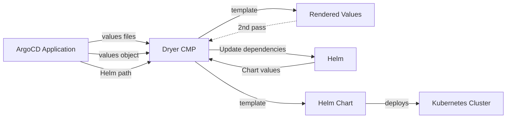
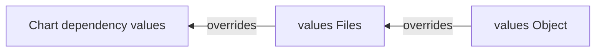

# helm-dryer 

An ArgoCD Config Management Plugin to compose value injection for Helm charts, by keeping the values
files really DRY.

<p align="center">
  
</p>

## Rationale

`helm-dryer` is an ArgoCD Config Management Plugin designed to help manage Helm charts
more efficiently by keeping the values files as simple and reusable as possible.
It helps in composing value injections for Helm charts, which means it can dynamically inject
values into Helm charts during the deployment process.

**DRY Principle**: By keeping the values files DRY, it avoids redundancy and repetition in the
values files. This makes the configuration more maintainable and easier to manage.

For example, a `values` file like the following one cannot honor [YAML anchors][] to fully reduce the
verbosity:

```yaml
configuration:
  clusterName: my-cluster
  storage:
  - name: s3
    bucket: eu-west-1-foo-123456789
    config:
      kmsKeyId: alias/eu-west-1-foo-bar
      region: eu-west-1
  region: eu-west-1
  accountId: 123456789
serviceAccount:
  annotations:
    eks.amazonaws.com/role-arn: arn:aws:iam::123456789:role/eu-west-1-foo
  name: my-cluster-sa
```

While this would be possible instead, given we inject the values referenced below as inline
arguments (similarly to `helm --set` key-value pairs):

```yaml
{{- $storageName: "s3" }} # we can also define variables :-)
configuration:
  clusterName: {{ .Values.clusterName }}
  storage:
  - name: {{ $storageName }}
    bucket: {{ printf "%s-%s-%s" .Values.region .Values.domain .Values.accountId }}
    config:
      kmsKeyId: {{ printf "alias/%s-%s-%s" .Values.region .Values.domain .Values.key }}
      region: {{ .Values.region }}
  region: {{ .Values.region }}
  accountId: {{ atoi .Values.accountId }}
serviceAccount:
  annotations:
    eks.amazonaws.com/role-arn: arn:aws:iam::{{ .Values.accountId }}:role/{{ .Values.region }}-{{ .Values.domain }}
  name: {{ .Values.clusterName }}-sa
```

## High-level Implementation

The following diagram describes the behavior of the plugin, which first renders the values and
finally templates the Helm chart with the rehydrated values for ArgoCD to deploy in the target
Kubernetes cluster.



Under the hood, the plugin is fed from (and merged in that order, with later taking precedence):

- Helm dependencies (if any) merged one after the other (in an umbrella chart-like tree).
  - For a dependency named `foo`, that means the values will hang from a parent key `foo`.
- ArgoCD values files (read one by one).
- ArgoCD values object (passed as key-value pairs).



## Usage

Create an ArgoCD application which uses this plugin like:

```yaml
apiVersion: argoproj.io/v1alpha1
kind: Application
metadata:
  name: test
  namespace: argocd
spec:
  project: default
  source:
    repoURL: https://github.com/lansweeper-oss/helm-dryer
    targetRevision: HEAD
    path: tests
    plugin:
      name: dryer-v1.0.0
      parameters:
        - name: settings
          map:
            ignoreMissing: "true"
            twoPass: "true"
        - name: valueFiles
          array:
            - values.yaml
            - values.tpl.yaml
            - values.stg.yaml
            - values.missing.file.yaml
        - name: valuesObject
          map:
            clusterName: eks-cluster-platform
            partition: aws
            accountId: "234796234"
            namePrefixWithoutDomain: eks-cluster
            foo: bar
  destination:
    server: https://kubernetes.default.svc
    namespace: test
```

Besides that, for CI or troubleshooting purposes, this plugin can be run manually as a regular CLI
that accepts three commands:

- `get`: used to get the merged+templated values.
- `template`: used to template a given Helm chart with merged values.
- `render`: a wrapper of `template` which assumes it's being called from ArgoCD
  (some parameters are injected as environment variables, see below).
- `render-app`: like template, but fed from an ArgoCD Application spec in YAML or JSON format.
  This command is meant to be used mainly for CI checks.

In order to check the usage of the tool, do:

```shell
go run .  --help

Usage: helm-dryer <command> [flags]

An ArgoCD CMP to pre-template values files.

Flags:
  -h, --help                       Show context-sensitive help.
  -a, --api-versions=,...          API versions (capabilities)
                                   ($KUBE_API_VERSIONS).
  -f, --files=FILES                Values files relative to Path.
  -k, --kube-version=""            Kubernetes version ($KUBE_VERSION).
  -r, --release-name=STRING        Release name ($ARGOCD_APP_NAME).
  -n, --release-namespace=STRING
                                   Release namespace ($ARGOCD_APP_NAMESPACE).
  -v, --set=KEY=VALUE,...          Injected key value pairs.
      --credentials.file=STRING    Path to OCI registry credentials file.
      --credentials.username=STRING
                                   OCI registry username ($OCI_USERNAME).
      --credentials.password=STRING
                                   OCI registry password ($OCI_PASSWORD).
      --credentials.registry="ghcr.io"
                                   OCI registry URL ($OCI_REGISTRY).
  -L, --delim-left="{{"            Template left delimiter.
  -R, --delim-right="}}"           Template right delimiter.
  -i, --ignore-missing             Ignore missing values files.
  -I, --ignore-empty               Ignore empty/null values.
  -m, --ignore-main-values         When present, ignore the implicit load of
                                   main values.yaml file.
      --logging.debug              Emit debug logs in addition to info logs.
      --logging.format="json"      Log format (json|console).
  -o, --out=""                     Output file (default: stdout).
  -p, --path="."                   Relative path to the chart.
      --skip-crds                  Skip CRDs in the templated output.
      --skip-schema-validation     Disable JSON schema validation.
      --skip-tests                 Skip tests from templated output.
  -t, --ttl=STRING                 Time-to-live in time.Duration format
                                   ($CACHE_TIMEOUT).
  -2, --two-pass                   Experimental. Perform a two-pass render.
  -u, --update-dependencies        Always update dependencies.

Commands:
  get [flags]
    Get the rendered values.

  render [flags]
    Render the template as a Configuration Management plugin.

  render-app [flags]
    Render from an ArgoCD Application file.

  template [flags]
    Render the template.

  version [flags]
    Show version and quit.

Run "helm-dryer <command> --help" for more information on a command.
```

### Render values

An example of (pre)rendering a set of values files follows:

```shell
go run . get --help

Usage: helm-dryer get [flags]

Get the rendered values.

Flags:
  -h, --help                       Show context-sensitive help.
  -a, --api-versions=,...          API versions (capabilities)
                                   ($KUBE_API_VERSIONS).
  -f, --files=FILES                Values files relative to Path.
  -k, --kube-version=""            Kubernetes version ($KUBE_VERSION).
  -r, --release-name=STRING        Release name ($ARGOCD_APP_NAME).
  -n, --release-namespace=STRING
                                   Release namespace ($ARGOCD_APP_NAMESPACE).
  -v, --set=KEY=VALUE,...          Injected key value pairs.
      --credentials.file=STRING    Path to OCI registry credentials file.
      --credentials.username=STRING
                                   OCI registry username ($OCI_USERNAME).
      --credentials.password=STRING
                                   OCI registry password ($OCI_PASSWORD).
      --credentials.registry="ghcr.io"
                                   OCI registry URL ($OCI_REGISTRY).
  -L, --delim-left="{{"            Template left delimiter.
  -R, --delim-right="}}"           Template right delimiter.
  -i, --ignore-missing             Ignore missing values files.
  -I, --ignore-empty               Ignore empty/null values.
  -m, --ignore-main-values         When present, ignore the implicit load of
                                   main values.yaml file.
      --logging.debug              Emit debug logs in addition to info logs.
      --logging.format="json"      Log format (json|console).
  -o, --out=""                     Output file (default: stdout).
  -p, --path="."                   Relative path to the chart.
      --skip-crds                  Skip CRDs in the templated output.
      --skip-schema-validation     Disable JSON schema validation.
      --skip-tests                 Skip tests from templated output.
  -t, --ttl=STRING                 Time-to-live in time.Duration format
                                   ($CACHE_TIMEOUT).
  -2, --two-pass                   Experimental. Perform a two-pass render.
  -u, --update-dependencies        Always update dependencies.
```

Example:

```shell
go run . get -f tests/values.tpl.yaml -f tests/values.stg.tpl.yaml --set clusterName=eks-cluster-platform,partition=aws,accountId=234796234 --set namePrefixWithoutDomain=eks-cluster
```

> Please note that out of the box, go template and [Sprig][] are supported as in a regular Helm template.
> Additionally, `fromYaml` and `toYaml` functions are available.
>
> At the moment, you can reuse a value already defined **if** the two-pass experimental feature is enabled,
> e.g. the following is supported:

```yaml
foo: bar
url: example.com/{{ .Values.foo }}  # would produce example.com/bar
```

### Template a Helm chart

```shell
go run . template --help

Usage: helm-dryer template [flags]

Render the template.

Flags:
  -h, --help                       Show context-sensitive help.
  -a, --api-versions=,...          API versions (capabilities)
                                   ($KUBE_API_VERSIONS).
  -f, --files=FILES                Values files relative to Path.
  -k, --kube-version=""            Kubernetes version ($KUBE_VERSION).
  -r, --release-name=STRING        Release name ($ARGOCD_APP_NAME).
  -n, --release-namespace=STRING
                                   Release namespace ($ARGOCD_APP_NAMESPACE).
  -v, --set=KEY=VALUE,...          Injected key value pairs.
      --credentials.file=STRING    Path to OCI registry credentials file.
      --credentials.username=STRING
                                   OCI registry username ($OCI_USERNAME).
      --credentials.password=STRING
                                   OCI registry password ($OCI_PASSWORD).
      --credentials.registry="ghcr.io"
                                   OCI registry URL ($OCI_REGISTRY).
  -L, --delim-left="{{"            Template left delimiter.
  -R, --delim-right="}}"           Template right delimiter.
  -i, --ignore-missing             Ignore missing values files.
  -I, --ignore-empty               Ignore empty/null values.
  -m, --ignore-main-values         When present, ignore the implicit load of
                                   main values.yaml file.
      --logging.debug              Emit debug logs in addition to info logs.
      --logging.format="json"      Log format (json|console).
  -o, --out=""                     Output file (default: stdout).
  -p, --path="."                   Relative path to the chart.
      --skip-crds                  Skip CRDs in the templated output.
      --skip-schema-validation     Disable JSON schema validation.
      --skip-tests                 Skip tests from templated output.
  -t, --ttl=STRING                 Time-to-live in time.Duration format
                                   ($CACHE_TIMEOUT).
  -2, --two-pass                   Experimental. Perform a two-pass render.
  -u, --update-dependencies        Always update dependencies.

  -A, --application-spec=STRING    Path to the Application spec file.
  -H, --disable-hooks              Disable Helm hooks.
```

For example:

```shell
go run . template -f tests/values.yaml -f tests/values.tpl.yaml -f tests/values.stg.tpl.yaml \
  --set clusterName=eks-cluster-platform,partition=aws,accountId=234796234,namePrefixWithoutDomain=eks-cluster \
  -p tests -r test -du
```

### Render a Helm template

This is essentially a wrapper on `template`, but assumes some information is passed as environment variables.

```shell
go run . render --help

Usage: helm-dryer render [flags]

Render the template as a Configuration Management plugin.

Flags:
  -h, --help                       Show context-sensitive help.
  -a, --api-versions=,...          API versions (capabilities)
                                   ($KUBE_API_VERSIONS).
  -f, --files=FILES                Values files relative to Path.
  -k, --kube-version=""            Kubernetes version ($KUBE_VERSION).
  -r, --release-name=STRING        Release name ($ARGOCD_APP_NAME).
  -n, --release-namespace=STRING
                                   Release namespace ($ARGOCD_APP_NAMESPACE).
  -v, --set=KEY=VALUE,...          Injected key value pairs.
      --credentials.file=STRING    Path to OCI registry credentials file.
      --credentials.username=STRING
                                   OCI registry username ($OCI_USERNAME).
      --credentials.password=STRING
                                   OCI registry password ($OCI_PASSWORD).
      --credentials.registry="ghcr.io"
                                   OCI registry URL ($OCI_REGISTRY).
  -L, --delim-left="{{"            Template left delimiter.
  -R, --delim-right="}}"           Template right delimiter.
  -i, --ignore-missing             Ignore missing values files.
  -I, --ignore-empty               Ignore empty/null values.
  -m, --ignore-main-values         When present, ignore the implicit load of
                                   main values.yaml file.
      --logging.debug              Emit debug logs in addition to info logs.
      --logging.format="json"      Log format (json|console).
  -o, --out=""                     Output file (default: stdout).
  -p, --path="."                   Relative path to the chart.
      --skip-crds                  Skip CRDs in the templated output.
      --skip-schema-validation     Disable JSON schema validation.
      --skip-tests                 Skip tests from templated output.
  -t, --ttl=STRING                 Time-to-live in time.Duration format
                                   ($CACHE_TIMEOUT).
  -2, --two-pass                   Experimental. Perform a two-pass render.
  -u, --update-dependencies        Always update dependencies.

  -A, --application-spec=STRING    Path to the Application spec file.
  -H, --disable-hooks              Disable Helm hooks.
```

The following keys are expected under `ARGO_APP_PARAMETERS`:

- `valueFiles`, a list of files containing values. If a file is missing, it will produce an error if
  the `ignoreMissing` flag is not enabled. No assumptions are made, and an explicit entry for
  `values.yaml` may be required when using raw values.
- `valuesObject`, an optional map of input values.
- `ignoreEmpty` [optional: `false`] a flag to ignore empty/null values.
- `ignoreMissing` [optional: `false`] a flag indicating if missing values files are ignored.
- `skipCRDs` [optional: `false`] a flag to skip installation of CRDs by the Helm chart.
- `skipSchemaValidation` [optional: `false`] a flag to skip JSON schema validation.
- `skipTests` [optional: `false`] a flag to skip Helm test resources.
- `twoPass` [optional: `false`] **Experimental**, allow template values files over themselves.

For example:

```yaml
apiVersion: argoproj.io/v1alpha1
kind: Application
spec:
  source:
    plugin:
      name: dryer-v1.0.0  # name-version if we specified the version when setting up the CMP (see below)
      parameters:
        - name: valueFiles
          array:
            - values.tpl.yaml
            - values.stg.yaml
        - name: valuesObject
          map:
            image.tag: v1.2.3
            foo: bar
            replicas: "2"
        - name: settings
          map:
            twoPass: "true"
      [...]
```

> Render will assume `--update-deps`

### Render from an ArgoCD Application spec

This command is meant to be used in CI, to validate what the plugin will produce for a given ArgoCD
Application, directly from its spec. The file can be either in YAML or JSON format.

> This command assumes the input comes from `-p` rather than parameters like `-f` or `-v`.

```shell
go run . render-app --help

Usage: helm-dryer render-app [flags]

Render from an ArgoCD Application file.

Flags:
  -h, --help                       Show context-sensitive help.
  -a, --api-versions=,...          API versions (capabilities)
                                   ($KUBE_API_VERSIONS).
  -f, --files=FILES                Values files relative to Path.
  -k, --kube-version=""            Kubernetes version ($KUBE_VERSION).
  -r, --release-name=STRING        Release name ($ARGOCD_APP_NAME).
  -n, --release-namespace=STRING
                                   Release namespace ($ARGOCD_APP_NAMESPACE).
  -v, --set=KEY=VALUE,...          Injected key value pairs.
      --credentials.file=STRING    Path to OCI registry credentials file.
      --credentials.username=STRING
                                   OCI registry username ($OCI_USERNAME).
      --credentials.password=STRING
                                   OCI registry password ($OCI_PASSWORD).
      --credentials.registry="ghcr.io"
                                   OCI registry URL ($OCI_REGISTRY).
  -L, --delim-left="{{"            Template left delimiter.
  -R, --delim-right="}}"           Template right delimiter.
  -i, --ignore-missing             Ignore missing values files.
  -I, --ignore-empty               Ignore empty/null values.
  -m, --ignore-main-values         When present, ignore the implicit load of
                                   main values.yaml file.
      --logging.debug              Emit debug logs in addition to info logs.
      --logging.format="json"      Log format (json|console).
  -o, --out=""                     Output file (default: stdout).
  -p, --path="."                   Relative path to the chart.
      --skip-crds                  Skip CRDs in the templated output.
      --skip-schema-validation     Disable JSON schema validation.
      --skip-tests                 Skip tests from templated output.
  -t, --ttl=STRING                 Time-to-live in time.Duration format
                                   ($CACHE_TIMEOUT).
  -2, --two-pass                   Experimental. Perform a two-pass render.
  -u, --update-dependencies        Always update dependencies.

  -A, --application-spec=STRING    Path to the Application spec file.
  -H, --disable-hooks              Disable Helm hooks.
```

See the Application spec example from `render` for a reference about the expected fields.

### Environment variables

Besides the [standard build environment variables][1], the plugin receives the `ARGOCD_APP_PARAMETERS`
variable, which is used to inject plugin-specific parameters.

### Plugin settings map

This plugin accepts optional settings to control its behavior. The following settings are currently
supported:

- `disableHooks` - Do not render Helm hooks.
- `ignoreEmpty` - Do not raise an error when a specific value is empty / null.
- `ignoreMissing` - Do not raise an error when a values file is missing.
- `skipCRDs` - Skip the CRDs if embedded in the Helm chart.
- `skipSchemaValidation` - Skip JSON schema validation.
- `skipTests` - Skip Helm test resources.
- `releaseName` - Override the release name, otherwise environment variable `ARGOCD_APP_NAME` or
  Application's `metadata.name` (in that order of precedence) is used.
- `releaseNamespace` - Override the release namespace, otherwise environment variable
  `ARGOCD_APP_NAMESPACE` or Application's `spec.destination.namespace` (in that order of precedence)
  is used.
- `ttl` - Per-app control of the chart dependency archives TTL
- `twoPass` - Experimental (see below) feature to do a 2-pass render of the values.

These settings can be customized per-application and override the global (CLI argument) ones.

## Known limitations and caveats

### Explicit values.yaml declaration

Unlike Helm, which automatically loads `values.yaml` when present, this plugin requires explicit
inclusion of all value files in the configuration.

As per design, the `values.yaml` file must be explicitly listed in the `valueFiles` parameter to be
included in the merged values.

This behavior is by default not followed when templating the Helm chart, since this plugin leverages
the Helm go SDK. For example, for the following example when specifying the files:

`-f foo.tpl.yaml -f bar.tpl.yaml`

in a folder like:

```text
app/
   |--- values.yaml
   |--- foo.tpl.yaml
   '--- bar.tpl.yaml
```

it will merge the values from the last 2 files (explicit), but **still** render the chart by reading
`values.yaml` (implicit).
This behavior can be switched off by setting the `IgnoreMainValues` flag.

### Values file extension

This plugin leverages the Helm SDK to resolve dependencies and render charts with merged values.
Since Helm automatically loads `values.yaml` and parses it as YAML, we cannot apply templating to
this specific file.

To work around this limitation, use a different filename extension when creating templated files,
such as `values.tpl.yaml`.

> This restriction only applies to the default `values.yaml` file.
> The plugin processes files based on their content, not their extension, so a file named
> `values.euw1.yaml` will undergo the same templating process as a file named `values.euw1.tpl.yaml`.

**Best practice**: Use `.tpl.yaml` extension for templated value files and `.yaml` for raw/static value files.

### Available functions and objects

Helm template specific functions are not supported. For instance, [Kubernetes and Chart functions][]
cannot be used (in the values files) as in a regular Helm chart.

[Builtin objects][] support is limited to `.KubeVersion`, `.Release.Name`, and `.Release.Namespace`
keys.

> This limitation only affects the values files, not the Helm templates which are unaffected.
> This plugin relies on the Helm SDK under the hood to template a Chart.

### Upstream Implementation restrictions

One of the most important limitations is a consequence of the whole [CMP implementation][].
The type of keys we inject as input parameters for a CMP can only be of types:

- `map[string]string` (e.g. `settings`, `valuesObject`)
- `[]string` (e.g. `valueFiles`)
- `string` (not used in this plugin)

That is, for the sake of simplicity we'll only support arrays and maps of strings and it should be
up to the templating code inside the values files to do type conversions accordingly, e.g.
if the upstream chart expects a boolean we should cast it as such.
This does not affect how the rest of the values (not templated ones) are treated by Helm.

### Caching

This plugin makes no assumptions about the maximum size of the cache. As with any other CMP, it
mounts an `emptyDir` volume in `/tmp`, which at the end is stored in the ephemeral storage of the
node it runs on. An `argocd-repo-server` pod running for too long may exhaust the ephemeral storage,
so we should take that into consideration when requesting/limiting the storage for the plugin container.

For example:

```yaml
  resources:
    requests:
      ephemeral-storage: "10Gi"
    limits:
      ephemeral-storage: "10Gi"
```

When `updateDependencies` is unset or false, we will cache not only the indices but the Helm chart
packages (a series of `.tgz` files) in the helm cache directory (which may be set with the environment variable
`HELM_CACHE_HOME` and defaults to `/tmp/helm-cache`).

As a first implementation, files expire after a customizable TTL (`CACHE_TIMEOUT` environment
variable) is passed.
When TTL is not set (or set to zero), this means that the cache is ignored and chart archives are
always considered stale.

### Read-only filesystem

When running `dryer` container with a `readOnlyRootFilesystem: true` security context, we need to mount:

- a volume for `/tmp`.
- [optional] a volume for `HELM_CACHE_HOME` (if not inside `/tmp`), where the cached files will be stored.
- another volume for `XDG_CONFIG_HOME` (typically `~/.config`) where Helm credentials will live.

```yaml
[...]
      env:
        - name: HELM_CACHE_HOME
          value: /helm-working-dir
      volumeMounts:
        - mountPath: /helm-working-dir
          name: helm-working-dir
        - mountPath: /.config
          name: helm-config
        - mountPath: /tmp
          name: cmp-tmp
    volumes:
    - emptyDir: {}
      name: cmp-tmp
    - emptyDir: {}
      name: helm-config
    - emptyDir: {}
      name: helm-working-dir
[...]
```

### Two-pass implementation

This is initially introduced as an experimental feature, since there might be potential issues when
rendering the values twice. Internally, the values files are first rendered from the injected
`valueObject`, then we use that result (merged with the input `valueObject` again) as
the "_values for the values_". This includes all the go-template/sprig modifications in the
resulting values.
Besides that, for Umbrella charts we'll get the rendered values in a nested map (this might change
in the future), e.g. `index .Values "aws-load-balancer-controller" "foo"`.

Two-pass rendering can also be beneficial when splitting configurations across multiple template
files becomes necessary, allowing cross-file value references without taking into account the
order in which files are read. For example:

`values.tpl.yaml`

```yaml
admins: [] # default
roles:
{{- range .Values.admins }}
  - name: {{ . }}
    role: admin
{{- end }}
```

Override: `values.stg.tpl.yaml`

```yaml
admins:
  - a-team
```

## ArgoCD integration

As with any other Configuration Management Plugin, `dryer` runs as a sidecar container of
`argocd-repo-server`.
The easiest way to add it is by setting the following values in the ArgoCD Helm chart:

```yaml
repoServer:
  extraContainers:
  - name: dryer-plugin
    command: [/var/run/argocd/argocd-cmp-server]
    image: ghcr.io/lansweeper/helm-dryer/helm-dryer:v1.0.0
    env:
      - name: HELM_CACHE_HOME
        value: /helm-working-dir
    resources:
      requests:
        ephemeral-storage: "10Gi"
      limits:
        ephemeral-storage: "10Gi"
    securityContext:
      runAsNonRoot: true
      runAsUser: 999
    volumeMounts:
      - mountPath: /var/run/argocd
        name: var-files
      - mountPath: /home/argocd/cmp-server/plugins
        name: plugins
      - mountPath: /home/argocd/cmp-server/config/plugin.yaml
        subPath: dryer.yaml
        name: plugin-config
      - mountPath: /tmp
        name: cmp-tmp
      - mountPath: /.config
        name: helm-config
      - mountPath: /helm-working-dir
        name: helm-working-dir
  volumes:
  - configMap:
      name: argocd-cmp-cm
    name: plugin-config
  - emptyDir: {}
    name: cmp-tmp
  - emptyDir: {}
    name: helm-config
  - emptyDir: {}
    name: helm-working-dir
  cmp:
    create: true
    plugins:
      dryer:
        version: v1.0.0 # Optional, must specify name-version if present
        generate:
          command:
          - dryer
          - render
          args:
          - --ignore-missing
        discover: {}
        parameters:
          static:
            - name: settings
              collectionType: map
              title: Plugin Settings
            - name: valueFiles
              collectionType: array
              title: Values Files
            - name: valuesObject
              collectionType: map
              title: Injected Values
```

## Build

```bash
export KO_DOCKER_REPO=...
ko build --base-import-paths [--tags ...]
```

## Test

```bash
go test ./... -cover
```

<!-- Links -->
[1]: https://argo-cd.readthedocs.io/en/stable/user-guide/build-environment/
[Builtin objects]: https://helm.sh/docs/chart_template_guide/builtin_objects/
[CMP Implementation]: https://argo-cd.readthedocs.io/en/stable/proposals/parameterized-config-management-plugins/#implementation-detailsnotesconstraints
[Kubernetes and Chart functions]: https://helm.sh/docs/chart_template_guide/function_list/#kubernetes-and-chart-functions
[Sprig]: (http://masterminds.github.io/sprig/)
[YAML anchors]: https://yaml.org/spec/1.2.2/#3222-anchors-and-aliases
