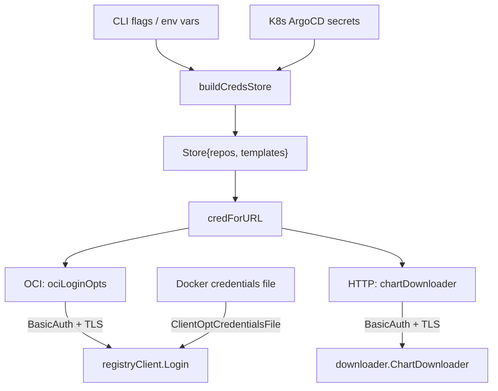

# Authentication

helm-dryer supports three authentication mechanisms for accessing OCI registries and HTTP Helm
repositories. These can be combined: for example, a Docker credentials file for public registries
and Kubernetes secrets for private ones.

## Basic Auth

Username and password authentication, supported for both OCI and HTTP repositories.

### Configuration

| Source | Fields |
|--------|--------|
| CLI flags | `--credentials.username`, `--credentials.password`, `--credentials.registry` (default: `ghcr.io`) |
| Environment variables | `OCI_USERNAME`, `OCI_PASSWORD`, `OCI_REGISTRY` |
| Kubernetes secrets | `username`, `password` fields in ArgoCD secret data |

When using CLI flags or environment variables, the credentials apply to a single registry
(specified by `--credentials.registry` / `OCI_REGISTRY`). When using Kubernetes secrets,
credentials are matched by URL.

### Behavior

- OCI registries: `ociRegistry.LoginOptBasicAuth(username, password)` is called per host.
- HTTP repositories: `getter.WithBasicAuth(username, password)` is passed to the chart downloader.
- Login is **skipped silently** if the username is empty, even when a password is present.

## TLS Client Certificate (mTLS)

Mutual TLS authentication using client certificates. Only available through Kubernetes secrets.

### Configuration

| Source | Fields |
|--------|--------|
| Kubernetes secrets | `tlsClientCertData` (PEM-encoded certificate), `tlsClientCertKey` (PEM-encoded private key) |

There are no CLI flags or environment variables for TLS client certificates.

### Behavior

- PEM data from the secret is written to temporary files (mode `0600`) via `writeTempPEM()`.
- OCI registries: `ociRegistry.LoginOptTLSClientConfig(certFile, keyFile, "")` is called.
- HTTP repositories: `getter.WithTLSClientConfig(certFile, keyFile, "")` is passed to the downloader.
- Temporary files are cleaned up after the download completes.
- The CA certificate argument is always empty, custom CA certificates are **not supported**.
  The registry's CA must be in the system trust store.

## Docker Credentials File

A Docker-format JSON credentials file, used only for OCI registries. This is the most flexible
method, as it can carry bearer tokens, service account tokens, or any credential format supported
by Docker's credential helpers.

### Configuration

| Source | Fields |
|--------|--------|
| CLI flag | `--credentials.file` |

### Behavior

- Passed directly to `ociRegistry.ClientOptCredentialsFile()` at registry client creation.
- This path **bypasses the credential store entirely**, it operates independently from basic auth
  and TLS credentials.
- Authentication is delegated to the Docker credentials file format and any configured credential
  helpers.

## Credential Store and URL Matching

When using CLI-based basic auth or Kubernetes secrets, credentials are stored in a `Store` that
matches repository URLs using two strategies:

1. **Exact match**: ArgoCD `repository` secrets. The URL must match exactly (after normalization).
2. **Longest-prefix match**: ArgoCD `repo-creds` secrets. The credential with the longest matching
   URL prefix is selected.

URL normalization trims trailing slashes and lowercases the scheme and host (path remains
case-sensitive).

### OCI login deduplication

OCI registry login is performed **per host**, not per repository. If two chart dependencies use the
same registry host, only the first credential match is used for login.

## Kubernetes Secrets

When `--credentials.secret` is set, helm-dryer fetches ArgoCD secrets from the Kubernetes API using
in-cluster configuration. Secrets are selected by label:

```text
argocd.argoproj.io/secret-type in (repository, repo-creds)
```

| Label value | Match strategy | Purpose |
|-------------|---------------|---------|
| `repository` | Exact URL match | Credentials for a specific repository |
| `repo-creds` | Longest-prefix match | Template credentials for a URL prefix |

The namespace is auto-detected from the pod's service account mount unless overridden by
`--credentials.namespace` / `ARGOCD_NAMESPACE`.

### Secret fields

| Field | Type | Description |
|-------|------|-------------|
| `url` | string | Repository URL |
| `username` | string | Basic auth username |
| `password` | string | Basic auth password |
| `tlsClientCertData` | []byte | PEM-encoded client certificate |
| `tlsClientCertKey` | []byte | PEM-encoded client private key |

## Data Flow



## Limitations

- **No cloud-native auth**: Automatic token exchange for ECR, ACR, and GCR is not built in
  (e.g., `ecr:GetAuthorizationToken`, Azure AD token refresh, GCR OAuth2). Users must
  authenticate externally and either supply a Docker credentials file (`--credentials.file`) or
  store static credentials (e.g., ACR service principals, ECR auth tokens) in ArgoCD Kubernetes
  secrets for basic auth.
- **No bearer token field**: `RepoCred` has no dedicated token field. Token-based auth is only
  possible through the Docker credentials file.
- **TLS is K8s-secret-only**: mTLS cannot be configured via CLI flags or environment variables.
- **No custom CA support**: The CA file argument is hardcoded to empty. Registries with custom CAs
  require the CA to be present in the system trust store.
- **Per-host OCI login**: Different credentials for different paths on the same registry host are
  not supported.
